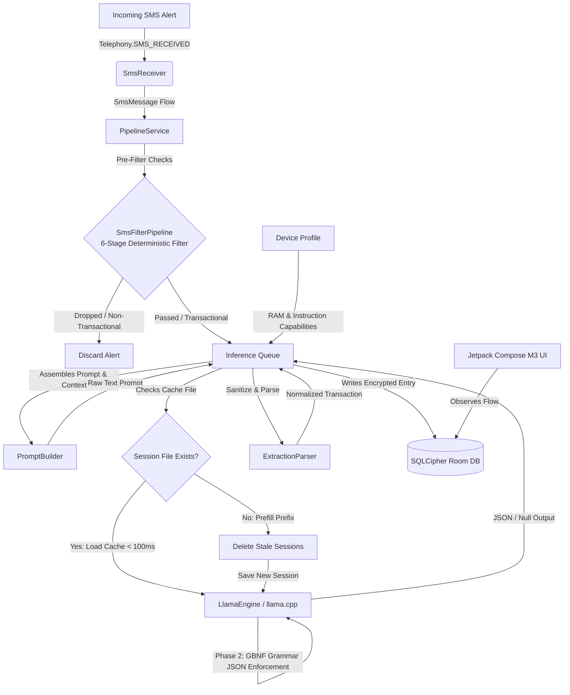

# Pocket Financer — Android

[](https://github.com/ManishAradwad/pocket-financer-android/actions)
[](https://github.com/ManishAradwad/pocket-financer-android/releases/latest)
[](https://developer.android.com/)
[](https://kotlinlang.org/)
[](https://www.zetetic.net/sqlcipher/)
[](LICENSE)

Pocket Financer is a secure, **privacy-first, on-device financial tracking and analytics application** designed specifically for Indian bank and card SMS notifications. It reads transactional alerts (such as bank debits, credit card swipes, UPI transfers, and deposits) and automatically populates a local dashboard.

By leveraging a local **Small Language Model (SLM)** backed by `llama.cpp` via a native JNI bridge, Pocket Financer runs its entire natural language extraction process 100% offline. **No data ever leaves your device. No cloud servers, no marketing trackers, no external APIs.**

---

## 🌟 Key Features

*   **Offline SLM Inference**: Processes SMS message semantics entirely locally using GGUF-based local LLMs.
*   **Deterministic SMS Pre-Filtering**: A 6-stage, regex-based filter running in `< 1ms` to filter out personal numbers, marketing/OTP alerts, and non-transactional messages before running model inference, preserving device CPU and battery.
*   **Three-Phase Reasoning Pipeline**:
    *   *Phase 0 (Pre-Filtering)*: Checks sender, currency amounts, masked accounts, and action verbs; filters out OTPs and collect requests.
    *   *Phase 1 (Chain of Thought)*: Dynamic allocation of `<think>` tokens (1024 token budget) to analyze the alert sender context and message logic.
    *   *Phase 2 (Grammar-Constrained Parse)*: Utilizes **GBNF (GGML BNF) Grammars** to force the model to output a strict, valid JSON transaction schema (guaranteeing a 100% parser success rate).
*   **Dynamic Hardware Auto-Tuning**: Smart hardware profiling detects device RAM capacities and CPU architectures (specifically checking for `ARMv8.2-A` instruction features like `i8mm` and `dotprod` to accelerate integer math) to select the optimal model size automatically.
*   **Disk-Based KV Cache Caching**: Saves and loads the static prefix KV cache state to/from disk using SHA-256 hashes. This cuts prefill time from ~140 seconds down to `< 100ms` on subsequent runs while automatically cleaning up old stale session files.
*   **Cryptographically Secured Database**: Persists transaction and account information in a Room database encrypted with **SQLCipher (AES-256)**, securing sensitive ledger data from third-party app leaks or root-level vulnerabilities.
*   **Real-time & Batch Synchronization**: Employs an Android `BroadcastReceiver` flow to catch transaction alerts as they land, combined with an inbox ContentProvider scraper to catch up on historical transactions during launch.
*   **Modern Jetpack Compose UI**: Designed around Material 3 dark-themed specs to present clean dashboards, insight graphs, transaction histories, and device diagnostics.

---

## ⚙️ How It Works (Dataflow Pipeline)



---

## 🏗️ Project Architecture

Pocket Financer is structured into specialized, decoupled Gradle modules to ensure clear separation of concerns, fast builds, and high testability:

```
pocket-financer-android/
├── :app          # Jetpack Compose UI (Material 3 Dark Theme) + Hilt Dependency Injection Root
├── :pipeline     # Pipeline Coordinator (orchestrates SMS parsing flows, Prompt building, & DB persistence)
├── :inference    # llama.cpp JNI Engine, NDK compiled Native C++ library, HuggingFace model downloader
├── :data         # Encrypted Database (Room + SQLCipher integration, DAOs, Entities, and Repositories)
├── :sms          # Real-time BroadcastReceiver + Inbox ContentProvider Scraper
└── :hardware     # Device Capability Profiler (validates RAM limits, CPU Neon, i8mm, and dotprod flags)
```

| Module | Core Responsibility | Key Stack / Components |
| :--- | :--- | :--- |
| **[`:app`](file:///d:/Personal_Projects/pocket-financer-android/app)** | Main User Interface & Settings | Jetpack Compose, Navigation Compose, Hilt, Material 3 |
| **[`:pipeline`](file:///d:/Personal_Projects/pocket-financer-android/pipeline)** | SMS Processing & Parsing Flow orchestration | Kotlin Coroutines, Hilt, JSON Serialization |
| **[`:inference`](file:///d:/Personal_Projects/pocket-financer-android/inference)** | Model runner & Assets manager | llama.cpp Native C++, Android NDK, CMake, JNI Bridge |
| **[`:data`](file:///d:/Personal_Projects/pocket-financer-android/data)** | Cryptographic Persistence | Room DB, SQLCipher, SQLite, AES-256 |
| **[`:sms`](file:///d:/Personal_Projects/pocket-financer-android/sms)** | Message capture and monitoring | Telephony API, ContentProvider, Kotlin Flows |
| **[`:hardware`](file:///d:/Personal_Projects/pocket-financer-android/hardware)** | CPU features profiling & model tuning | System OS API, Android NDK cpufeatures |

---

## 🧠 Three-Phase Processing Pipeline

Extracting structured data from highly unstructured, localized SMS alerts (which vary drastically across dozens of Indian financial institutions) requires a reliable and power-efficient parsing mechanism:

1.  **Phase 0: Deterministic SMS Pre-Filtering**:
    Before waking the SLM execution engine, the incoming message runs through a 6-stage regex validation check ([SmsFilterPipeline.kt](file:///d:/Personal_Projects/pocket-financer-android/pipeline/src/main/java/com/pocketfinancer/pipeline/SmsFilterPipeline.kt)) to assert that the alert contains actual transaction markers (amounts, masked accounts, action verbs) and excludes verification codes/OTPs and pending payment collect requests. If any stage fails, processing terminates instantly (taking less than 1ms), avoiding unnecessary CPU-heavy model evaluations.
2.  **Phase 1: Thinking Pass (Chain of Thought)**:
    For messages that pass the pre-filter, the system builds the inference prompt (merging the system prompt and few-shot examples) and appends `<think>` to the end. The local SLM processes the SMS semantics, reasoning step-by-step to verify transaction details.
3.  **Phase 2: Constrained JSON Generation**:
    Once the thinking tag is closed with `</think>`, the native JNI engine applies a strict Backus-Naur Form (GBNF) grammar defined in [sms_extraction.gbnf](file:///d:/Personal_Projects/pocket-financer-android/inference/src/main/assets/sms_extraction.gbnf). This grammar constrains the vocabulary sampling to force the model to output a strict, valid JSON transaction schema (guaranteeing a 100% parser success rate):
    ```json
    {
      "amount": 1500.00,
      "counterparty": "MIDAS DAILY",
      "type": "debit", // or "credit"
      "account": "A/c XX6254"
    }
    ```
    If the message is determined to be non-financial, the grammar enforces outputting a simple literal `"null"`.

---

## ⚡ Performance Optimizations & Caching

To make local inference responsive and preserve battery life, Pocket Financer implements high-performance CPU optimizations, disk-based KV Cache caching, and automatic cleanup:
*   **Arm KleidiAI Acceleration**: Integrates Arm's official KleidiAI micro-kernels dynamically for `arm64-v8a` targets. This leverages hardware-specific `dotprod` (Dot Product), `i8mm` (Int8 Matrix Multiplication), and `sme` (Scalable Matrix Extension) instructions on supported ARMv8 and ARMv9 CPUs to dramatically accelerate quantized matrix multiplication.
*   **Dynamic KV Cache Precision (F16 vs. Q8_0)**: Automatically selects KV cache precision based on hardware capabilities. On modern CPUs supporting native FP16 calculations, it uses `F16` to leverage hardware vector math and CPU Flash Attention. On older CPUs lacking native FP16 hardware (e.g., Galaxy A50), it falls back to `Q8_0` to bypass slow software FP16 emulation overhead.
*   **Auto-Thread Tuning**: Rather than hardcoded limits, the engine configures thread counts dynamically by passing `0` to let `llama.cpp`'s native C++ scheduler determine the thread count. This defaults to `std::min(cores, 4)` (optimizing octa-core CPUs with 4 threads, which fully engages performance cores without thrashing cores or causing thermal build-up).
*   **Static Prefix Caching**: The static prompt prefix (~1,800 tokens of system prompt + few-shot examples) is prefilled once, and the native JNI engine serializes the resulting KV cache to disk as `session_<sha256>.bin` inside the secure app storage.
*   **Instant Load**: On subsequent inference runs, the pre-saved session is loaded from disk in under `100ms`, completely bypassing the heavy prefill phase.
*   **Automatic Cache Invalidation**: The session file name matches the SHA-256 hash of the static prefix. Any modifications to `system_prompt.txt` or `few_shot_examples.json` will automatically trigger a new prefill run on the next execution.
*   **Stale Cache Deletion**: To prevent disk clutter, whenever a new session file is generated, the engine automatically deletes all older stale `session_*.bin` cache files from device storage.

---

## 📱 Dynamic SLM Selection Matrix

To run local inference smoothly without triggering Android's low-memory killer (LMK), the app performs a detailed hardware check on startup and downloads/allocates a model matching the device's capability tier:

| Model ID | Model Family | Quantization | Size | Min. RAM | CPU Requirement | Status / Target |
| :--- | :--- | :--- | :--- | :--- | :--- | :--- |
| **`Gemma 4 E2B Q8_0`** | Gemma 4 (E2B) | 8-bit | ~5.00 GB | **8.0 GB** | ARMv8.2-A with `i8mm` + `dotprod` | **Highest Quality** (Default for high-end devices) |
| **`Gemma 4 E2B Q4_K_M`**| Gemma 4 (E2B) | 4-bit (Medium) | ~3.10 GB | **6.0 GB** | Standard ARMv8 | **Balanced** (Optimal for mid-to-high devices) |
| **`Qwen3-1.7B Q8_0`** | Qwen 3 (1.7B) | 8-bit | ~1.95 GB | **4.0 GB** | ARMv8.2-A with `i8mm` + `dotprod` | **High Quality Thinking** (Default for mid-range CPU) |
| **`Qwen3-1.7B Q4_K_M`** | Qwen 3 (1.7B) | 4-bit (Medium) | ~1.10 GB | **3.5 GB** | Standard ARMv8 | **Balanced Thinking** (Optimal for mid-range) |
| **`Qwen3-0.6B Q8_0`** | Qwen 3 (0.6B) | 8-bit | ~0.70 GB | **2.5 GB** | Standard ARMv8 | **Lightweight Fallback** (For budget devices) |
| **Blocked** | — | — | — | **< 2.5 GB**| — | *Incompatible (Device cannot execute local SLMs)* |

*Note: GPU acceleration is disabled on Android for model selection. CPU instruction execution (using Neon assembly and specialized hardware dot product features) is substantially faster and more power-efficient than mobile GPU JNI roundtrips in llama.cpp.*

---

## 🔒 Hardened Security & Privacy

*   **100% Local Scope**: The Android manifest restricts network permissions except for the initial HuggingFace model download. Decryption, extraction, parsing, and database transactions occur fully offline.
*   **AES-256 SQLCipher Database**: Prevents root-level memory scrapers or physical extraction of the database. The Room database is wrapped inside a SQLCipher cryptographic engine using key generation logic.
*   **Account Anonymization**: The database only stores anonymized account handles (e.g. the last 4 digits extracted from raw SMS strings like `"Account XX5812"`), stripping out full names, routing info, or explicit bank identifiers where possible.

---

## 🛠️ Getting Started & Build Instructions

### Prerequisites
*   **Android Studio** (Koala / Ladybug or later stable version)
*   **JDK 17** (configured as your Gradle system JDK)
*   **Android SDK 36**
*   **Android NDK 27.3** (specified in your local configurations)

### Local Configuration Setup
Create a file named `local.properties` in the root directory and specify your Android SDK and NDK paths:
```properties
sdk.dir=/path/to/android-sdk
ndk.dir=/path/to/android-sdk/ndk/27.3.13750724
```

### Build Commands
Run these commands from your terminal:

```bash
# 1. Clone the repository
git clone https://github.com/ManishAradwad/pocket-financer-android.git
cd pocket-financer-android

# 2. Run module unit tests (Validates database DAOs, SMS parsers, Prompt Builder logic)
./gradlew :data:test :pipeline:test :hardware:test :sms:test :inference:test -x :inference:build -x :app:build

# 3. Compile and generate debug APK
./gradlew :app:assembleDebug

# 4. Generate release build
./gradlew :app:assembleRelease
```

---

## 📈 Project Status & Roadmap

- [x] **Phase 1-4**: Core Native JNI bindings, llama.cpp compilation, & Model Downloader pipeline.
- [x] **Phase 5**: Pipeline service orchestration, validation rules, & SQLCipher secure database persistence.
- [/] **Phase 6**: UI screen development. Dashboard registers (`Transactions` tab with full date-grouped cards, debit/credit filters, and SLM metadata bottom sheets) and Settings debug metrics are active. Dashboard summary (`Home` tab) and analytics graphs (`Insights` tab) are under development.
- [ ] **Phase 7**: Background Worker integration for sleeping SMS parses.

---

## 📄 License

This project is licensed under the MIT License. See the [LICENSE](LICENSE) file for details.

---

## 🤝 Acknowledgments

*   [llama.cpp](https://github.com/ggerganov/llama.cpp) — Core engine powering local, on-device SLM execution.
*   The SLM Evaluation Pipeline ([`pF_slm_selection`](https://github.com/ManishAradwad/pF_slm_selection)) which identified the best Small Language Models for this app.
