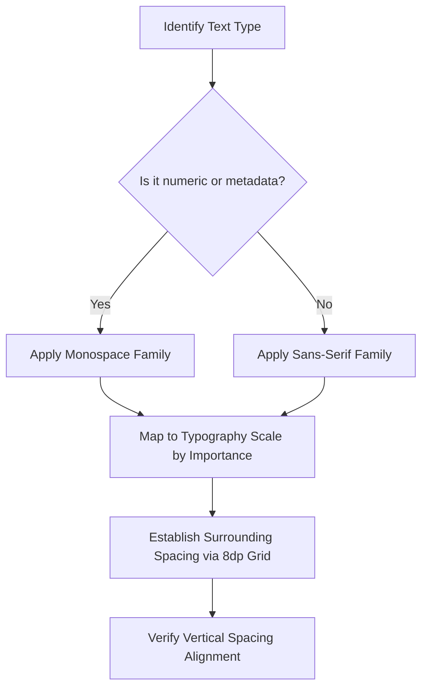

# Typography & Spacing Design Specification

This specification establishes a formal standard for visual typography and spacing proportion across all screens in the **pocketFinancer** app. The goal is to unify the design language by balancing readable text and proportioned "open space".

---

## 1. Visual Archetype & Font Pairing Strategy

The visual identity of **pocketFinancer** sits at the intersection of professional financial management and technical simplicity. To reinforce this archetype, we utilize a dual-font pairing system:

1. **Sans-Serif Family (System Default / Roboto / Inter)**:
   * **Purpose**: Primary readability, brand identity, navigation elements, primary card labels, and merchant descriptions.
   * **Feel**: Clean, approachable, and highly readable.
2. **Monospace Family (System Monospace)**:
   * **Purpose**: Technical details, precise currency values, dates, timestamps, account numbers, and metadata tag lines.
   * **Feel**: Developer-oriented, accurate, structured, and visually crisp.

### Core Alignment Rule
* **Descriptions, labels, and names** use Sans-Serif.
* **Numbers, counts, codes, dates, and currency values** use Monospace.
* This distinction must remain identical across the **Home**, **Ledger**, **Insights**, and **Settings** screens.

---

## 2. Standardized Typography Scale

To eliminate inline styling discrepancies (e.g., arbitrary sizes like `9.sp` or `13.sp` next to `10.sp`), we establish the following standard scale:

| Typography Token / Alias | Size (SP) | Weight | Line Height | Font Family | Typical Use Cases |
| :--- | :--- | :--- | :--- | :--- | :--- |
| **amountHero** (backed by `headlineLarge`) | `32.sp` | `Bold` | `40.sp` | `Monospace` | Primary screen amounts (e.g. Home card balance, Ledger transaction detail amount) |
| **screenHeader** (backed by `titleLarge`) | `22.sp` | `Bold` | `28.sp` | `SansSerif` | Screen title headers in lowercase camelCase (e.g. `pocketFinancer`, `transactionLedger`) |
| **MaterialTheme.typography.titleMedium** | `16.sp` | `Medium` | `24.sp` | `SansSerif` | Main section headings (e.g. "Recent synced transactions", "Cash Flow Summary") |
| **MaterialTheme.typography.bodyMedium** | `14.sp` | `Normal` | `20.sp` | `SansSerif` | Merchant name, generic body text |
| **MaterialTheme.typography.bodySmall** | `12.sp` | `Normal` | `16.sp` | `SansSerif` | Descriptions, supporting body details, sub-information |
| **MaterialTheme.typography.labelLarge** | `14.sp` | `Medium` | `20.sp` | `SansSerif` | Pill button texts, CTA/actions (e.g. "Scan" button, "All" filter chip) |
| **accountCode** (backed by `labelMedium`) | `12.sp` | `Medium` | `16.sp` | `Monospace` | Account cards/tags (e.g., `HDFC ••1234`), numerical summaries in tabs |
| **timestamp** (backed by `labelSmall`) | `11.sp` | `Medium` | `16.sp` | `Monospace` | Small metadata text, timestamps, dates (e.g. `MESSAGE STREAM SYNCED`, `20:59`) |

---

## 3. Spacing Grid & Open Space Proportions

Visual harmony relies heavily on "negative space" or "breathing room." We employ an **8dp spacing grid** (with a `4dp` sub-unit for tight relationships):

* **Outer Screen Margin**: `16.dp` padding on the left and right of every list, column, or root container. This creates a solid vertical alignment axis.
* **Vertical Arrangement (Between Cards)**: `16.dp` spacing (`Arrangement.spacedBy(16.dp)`) between separate information cards to give each container visible distinction.
* **Internal Card Padding**: `16.dp` padding on all sides inside major cards (e.g. Hero Card, Insights cards). This ensures text is never crowded near borders.
* **Visual Hierarchy Spacing**:
  * **Header to Content**: `12.dp` or `16.dp` space between a title and its details.
  * **Title to Subtext**: `8.dp` spacer.
  * **Label to Value**: `4.dp` spacing for immediate contextual linkage (e.g. label "Inflow" to value "₹0").

---

## 4. Current Inconsistencies vs. Proposed Harmony

### A. Large Currency Discrepancies
* **Current Issue**: On the **Home** screen, the main balance uses a `32.sp` `SansSerif` extra-bold font, while the transaction detail screen uses `32.sp` `Monospace` bold for the amount.
* **Remediation**: Standardize all large currency balances to `32.sp`, `Bold`, `Monospace` (via `AppTypography.amountHero`) for visual consistency. Monospace numbers align beautifully on decimal points and currency symbols.

### B. Micro Metadata Sizes
* **Current Issue**: Inline text uses random sizes such as `8.sp`, `9.sp`, `10.sp`, and `11.sp` for small detail rows.
* **Remediation**: Use `AppTypography.accountCode` (`12.sp` Monospace) for account codes, and `AppTypography.timestamp` (`11.sp` Monospace) for metadata tags, timestamps, and list timestamps. No text size should fall below `11.sp` to maintain accessibility and sharp rendering.

### C. Open Space Consistency
* **Current Issue**: Header spacing and list paddings differ. The Home screen headers use a custom row layout with different paddings, whereas the Ledger top-bar uses a custom icon alignment.
* **Remediation**: Enforce a unified `Modifier.padding(horizontal = 16.dp)` on all header rows and ensure card containers have consistent margin-offsets.

---

## 5. Formal Procedure for Selection (Implementation Plan)

When adding or refactoring UI components, developers should follow this formal sequence:



### Centralizing the Code Architecture
Instead of inline `fontSize` and `fontFamily` parameters, the project should define these types inside `Type.kt` and apply them using `style = MaterialTheme.typography.x` or via a custom typography wrapper `PocketFinancerTypography`:

```kotlin
// Example centralized baseline definitions in Theme/Type
val PocketFinancerTypography = Typography(
    headlineLarge = TextStyle(
        fontFamily = FontFamily.SansSerif,
        fontWeight = FontWeight.Normal,     // M3: 400
        fontSize = 32.sp,
        lineHeight = 40.sp
    ),
    titleLarge = TextStyle(
        fontFamily = FontFamily.SansSerif,
        fontWeight = FontWeight.Normal,     // M3: 400
        fontSize = 22.sp,
        lineHeight = 28.sp
    ),
    labelSmall = TextStyle(
        fontFamily = FontFamily.Monospace,  // Monospace for timestamps
        fontWeight = FontWeight.Medium,     // M3: 500
        fontSize = 11.sp,
        lineHeight = 16.sp
    )
    // ...
)
```
This ensures a single source of truth for font sizing, weights, and letter spacings.
